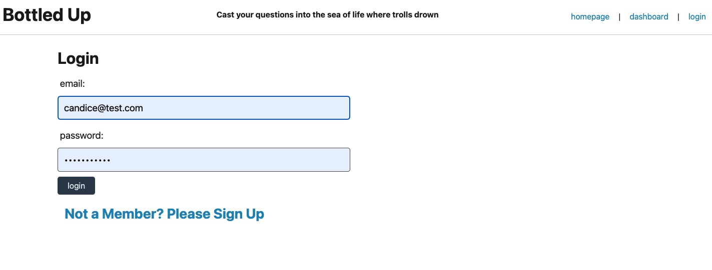
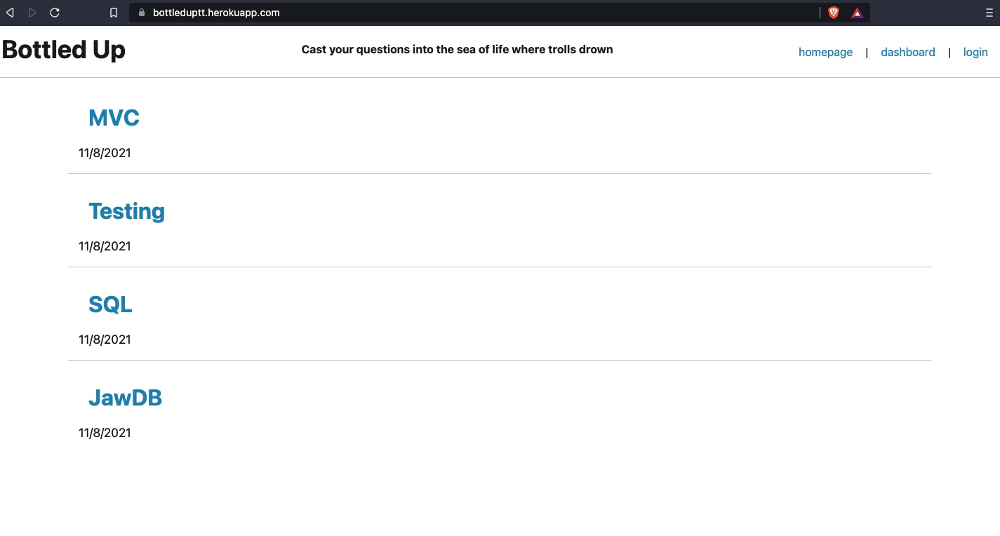
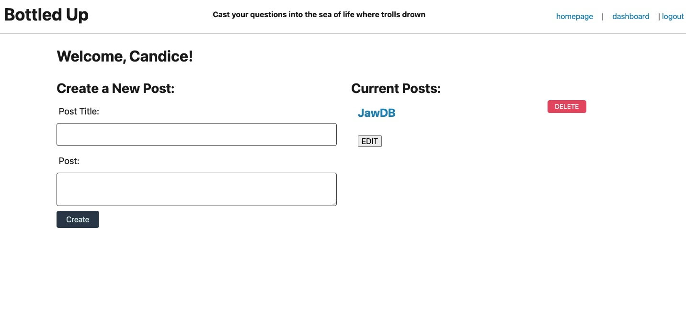
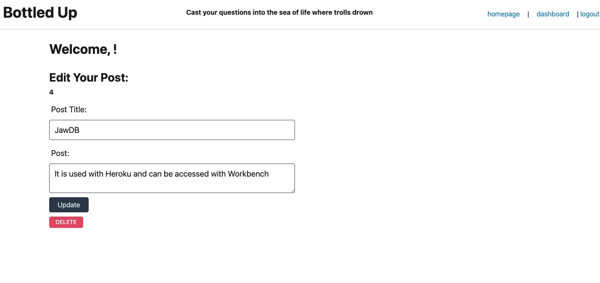

# Bottled_Up_TT

  ## Table of Contents
  * [Description](#descrip)
  * [Installation](#install)
  * [Usage](#usage)
  * [Contributions](#contri)
  * [Tests](#tests)
  * [Contact & Qustions](#contact)
  * [License](#license)
  * [Powered By](#powered-by)
  
  ### Description:
      We were tasked with creating a blog site that delt with technology.  Users needed to be able to create an new accoun and fully edit their posts.  They also needed to be able to comment on other post that were on the site.  The build require javascript, Express, dotenv, sequelize, bcrypt, handlebars, and sessions. 

  
  ### Installation:
    Website
    
https://bottleduptt.herokuapp.com/

    GitHub repository

https://github.com/DerTodd/Bottled_Up_TT

The user dashboard allows you to see everything that you have posted.  You can also delete straight from this page.

You can edit and delete your posts

  
  ### Usage: 
      To blog about technology in a full stack application.

  
  ### Contributions:
      Tutor Brian Lee, Classmates: Brian, Alex, and Chuck.

  
  ### Tests
      none

  
  ### Contact & Qustions
  If you have any questions, suggestions or concerns, please contact me at:  
  GitHub  
  https://github.com/DerTodd  
  email  
      todd.taylor@utexas.edu  

  
  ### License:
  [MIT](https://opensource.org/licenses/MIT)

  
  #### Powered By
    
    
   